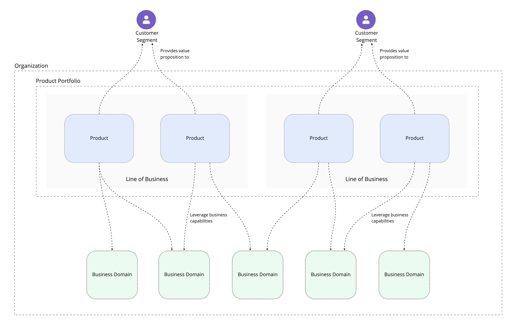
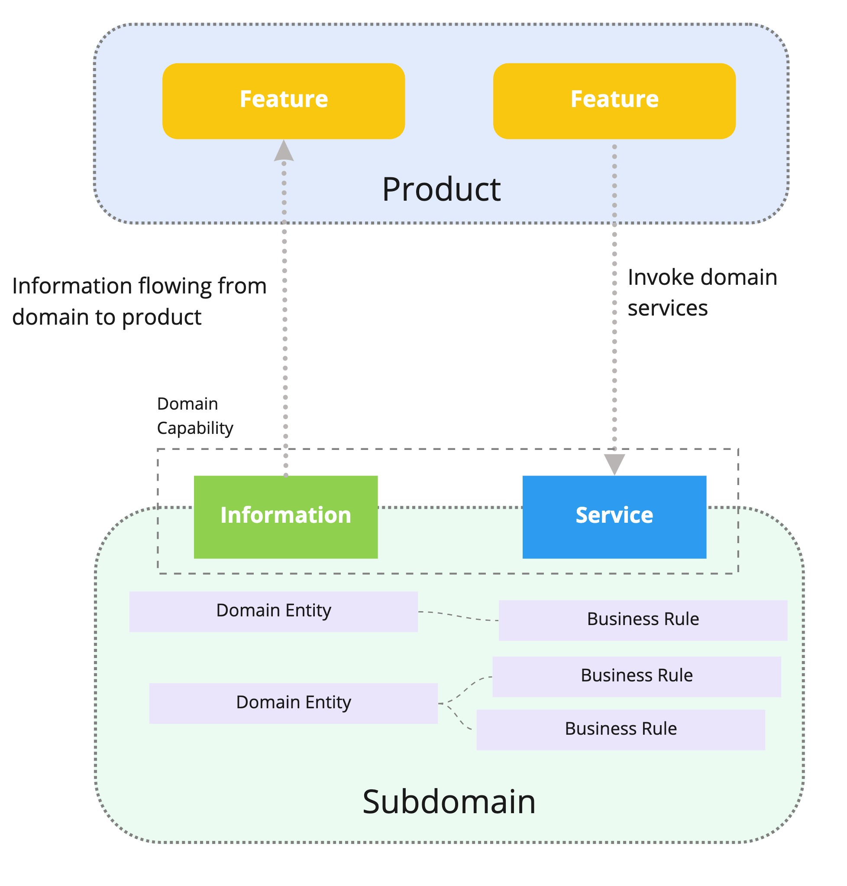
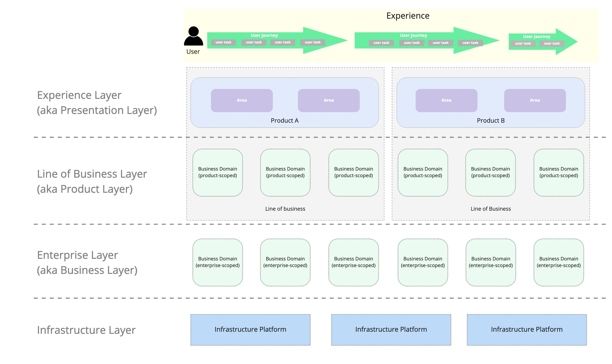

# Product & Domain-Oriented Business Architecture Building Blocks

This collection of building blocks describes elements of business architecture which can be used to shape boundaries in software architecture and organization structure. By having a shared language of architecture building blocks you can spend more of your time improving the design resulting in a better-designed [socio-technical architecture](https://esilva.net/sociotechnical/sociotechnical-architecture_why-and-what.html) and greater alignment across an organization.

This content is all creative commons. You are free to use and remix as you please, and there is no connection to any proprietary products or services.

## Motivations

Excessive ambiguity in architecture terminology can lead to misalignment or time lost debating semantics. Both of these problems can result in a poorly designed architecture, and fundamental issues that impact the quality of customer experiences and the pace at which teams can deliver.

Some of the phrases used to describe architectural concepts originate from methodologies, frameworks, or communities. This can leave people feeling excluded from the conservation when they aren't familiar with these words and the definitions of these words is not easily accessible.

The purpose of this initiative is to address the above issues by providing clear definitions that people can use to describe components in their business, software, and organizational architecture.

## How to Use these Building Blocks

These building blocks can be used verbatim or customised to the particularities of your organization. You may decide to create your own architecture building blocks in which case this collection may serve merely as inspiration. The important outcome is being able to effectively design and communicate architecture in your organization.

## Relationship to other Frameworks

This collection of building blocks does not aim to dictate in any way the process or framework used to design architecture. It is purely a domain-specific language for describing architecture. There is no relationship to any business architecture frameworks, TOGAF, Domain-Driven Design, or any other proprietary or open frameworks. However, you can combine these building blocks with other frameworks and methodologies if you wish.

## Credits

These building blocks draw inspiration heavily from the following resources:

- [What is a Digital Product](https://www.romanpichler.com/blog/what-is-a-digital-product/), by Roman Pichler
- [Introducing Domain-Oriented Microservice Architecture](https://eng.uber.com/microservice-architecture/), by Uber
- [Team Topologies](https://teamtopologies.com/), by Matthew Skelton and Manuel Pais
- [Business Model Generation](https://www.strategyzer.com/books/business-model-generation), by Alexander Osterwalder & Yves Pigneur

## Other Models to Consider

- [Product Taxonomy: The Seven Domains Of Transformation](https://itrevolution.com/product-taxonomy-the-seven-domains-of-transformation/) by Ross Clanton, Amy Walters
- [ArchiMate](https://pubs.opengroup.org/architecture/archimate3-doc/), by The Open Group

## Contributing

All efforts to improve these building blocks and associated content are greatly appreciated and welcomed. The journey has only just started and the path ahead is unknown. This may turn out to be a failed attempt or it could improve the experience of many technology and product professional. If you'd like to help out, please do in the following ways:

- Create an issue to suggest improvements, ask questions, or share experiences
- Raise a pull request with any suggestions or improvements (if you need to update images, you can copy the content from the [Miro board](https://miro.com/app/board/o9J_lQi136o=/))

## The Building Blocks

These building blocks intentionally span business, software, and organizational architecture, with the goal of co-designing and jointly-optimising all three architectures.

This collection is not exhaustive. There may not be a building block which describes a concept in your architecture. Contributions and feedback are always welcome.

You can also view these building blocks on the interactive [Miro board](https://miro.com/app/board/o9J_lQi136o=/).

### Products, Portfolios, and Business Domains

An organization has one or more products that deliver [value propositions](https://www.shopify.co.uk/blog/value-proposition) to one or more customer segments. Products may be partitioned into [lines of business](https://www.gartner.com/en/information-technology/glossary/lob-line-of-business) which address specific business needs. A [product portfolio](https://www.investopedia.com/terms/p/product-portfolio.asp) is all of the products and services offered by a company.

A business domain is an area of expertise or interest to the business, in which the business develops capabilities to deliver its value propositions such as the ability to register an account or place a trade. Products are powered by the capabilities that exist in the business domains.

#### Value Proposition Types

Products can offer different types of value proposition. External-facing products generate revenue or they can also help to sell other products. Internal products can help to increase employee/organizational productivity or reduce the costs of doing business.

#### Product Bundles

A group of products that are sold/used together is a bundle. Not all products have to belong to a bundle. Roman Pichler uses the example of Microsoft Office.

#### Product Features & Areas

A digital product provides features. Features can be grouped into product areas for larger products.

#### Product Variants

A digital product may have multiple variations. All variations deliver the same value proposition. For example: Android, iOS, and web apps.

### User Experience & Journeys

User journeys and experiences are what the user does and feels. They are outside of the software. An individual user journey is composed of one or more user tasks, and a user journey can span multiple products and variants.

### Business Domains & Subdomains

A business domain is a conceptual/logical grouping of related business concepts. It can also be thought of as an area of interest or specialisation. 

Business concepts within domains are leveraged to build capabilities that power products and contribute to delivering value propositions.

Domain is a fuzzy word which can apply at different levels of scale including Micro, Meso, and Macro.

- **Micro Domain**: an area of the business that is small enough to be owned by a single team (aka subdomain in DDD)

- **Meso Domain**: an area of the business where a group of teams work together towards common goals (aka Domain in Uber DOMA)

- **Macro Domain**: highest/enterprise level covering large areas of the business. Depending on the size of the company you may want to further qualify macro domains but I haven't had the need to yet.

- **Top-level Domain**: the highest level of scale in an organization (in cases where macro is insufficient)

#### Domain Capabilities, Rules, and Entities

A subdomain exposes one or more domain capabilities which are leveraged by product features or internal business workflows (subdomain to subdomain interactions).

A domain capability can be an information provider and/or a service provider. Information providers supply domain-related information and service providers enable business transactions, processes, and workflows to be initiated.

Within a subdomain, domain entities represent concepts from the domain with an identity and a lifecycle (akin to a state machine). [Business rules](https://www.techopedia.com/definition/28018/business-rule) can be associated with entities (or operate independently) to constrain the behaviour of systems or people.

### Architecture Layers

Each of the building blocks sits within a conceptual layer. Layers on top depend on layers below.

The visible aspects of a product that expose capabilities from business domains form the presentation layer.

Business domains can either be scoped to a single line of business and live in the line of business layer, or scoped across the entire enterprise (leveraged by multiple lines of business) and live in the enterprise layer.

In order for business domains to be developed and operated, infrastructure platforms, living in the infrastructure layer, are required.